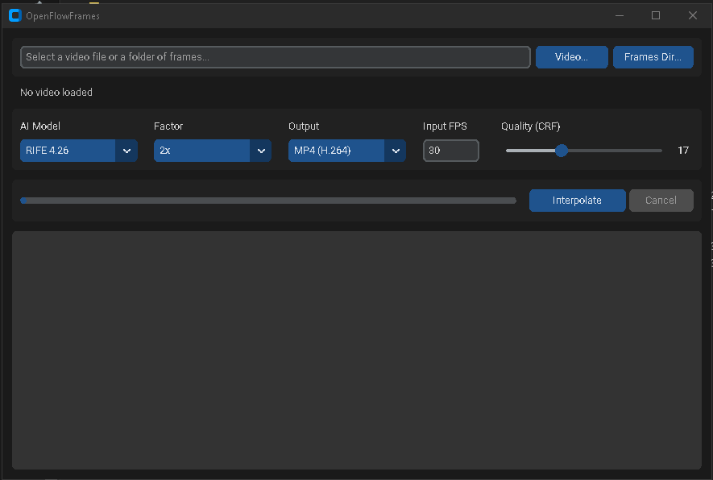

# OpenFlowFrames - Video Frame Interpolation for Windows

This project is a fork of the original [Flowframes by n00mkrad](https://github.com/n00mkrad/flowframes). Huge thanks to him for creating and maintaining the powerful core of this application!

This fork focuses on staying **fully free and open** — no Patreon tiers, no paid builds — with **up-to-date RIFE models** and a new **modern Python GUI** alongside the original Windows app.

### Screenshot

*Main interface: pick a video or a folder of frames, choose a model and factor, interpolate.*



## ✨ Features

This fork includes all the powerful core features of the original, plus:

*   **Latest RIFE Models:** RIFE 4.25 and 4.26 for the CUDA (PyTorch) backend, bundled directly in the repo (the original download server only hosts up to 4.13). The NCNN backends include up to 4.26 as well.
*   **Modern GUI (OpenFlowFramesPy):** A clean CustomTkinter dark-mode interface — no install needed beyond Python.
*   **Video or Frame-Folder Input:** Interpolate a video file, or a directory of PNG/JPG/WebP frames with a custom input framerate.
*   **MP4 or PNG Output:** Encode to H.264 MP4 (audio preserved) or export the interpolated frames as a PNG sequence.
*   **Portable Windows Executable:** Build a self-contained portable app with one script — no Python needed on the target machine.
*   **Auto Model Download:** NCNN model weights are fetched and validated automatically on first use.
*   **No Monetization:** All Patreon/PayPal integrations removed; updates point to GitHub releases.

### Core Features (from the original)

- GPU-accelerated frame interpolation with RIFE (NCNN + Pytorch), DAIN (NCNN), FLAVR and XVFI (Pytorch)
- Works on any modern Vulkan-capable GPU (AMD/Intel/NVIDIA) via NCNN
- Batch processing, scene-change handling, speed/slow-motion modes, GIF/WebM support (C# app)

## 💻 How to Use (Easy Way)

**Python GUI (recommended):**

1.  Clone this repository:
    ```bash
    git clone https://github.com/ZeroHackz/OpenFlowFrames.git
    ```
2.  Double-click `OpenFlowFramesPy/launcher-gui.bat` — it sets up a virtual environment on first run and launches the GUI.

**Portable build:**

Run `OpenFlowFramesPy/build-portable.bat`. The result in `OpenFlowFramesPy/dist/` is fully self-contained:

```
dist/
  OpenFlowFramesPortable.exe
  Pkgs/av/           (ffmpeg)
  Pkgs/rife-ncnn/    (interpolator; models download here on first use)
```

Copy the `dist` folder anywhere and double-click the exe.

## 🛠️ The Original C# App

The full Flowframes WinForms application lives in `Flowframes/` and builds with .NET 8:

```bash
dotnet build Flowframes/Flowframes.csproj
```

Note: it expects the [nmkd-utils](https://github.com/Randy420Marsh/nmkd-utils) project as a sibling directory (`../nmkd-utils` relative to the repo root).

For the PyTorch (CUDA) backends, see [PythonDependencies.md](PythonDependencies.md).

## How It Works

1. `ffprobe` reads the input framerate and frame count (or you provide the FPS for a frame folder).
2. `ffmpeg` extracts frames (skipped for frame-folder input).
3. `rife-ncnn-vulkan` interpolates to `frames × factor`.
4. `ffmpeg` encodes H.264 at the multiplied framerate, copying the original audio — or the frames are exported as PNGs.

## Credits

- [Flowframes](https://github.com/n00mkrad/flowframes) by n00mkrad — the original application this fork is based on
- [RIFE](https://github.com/hzwer/Practical-RIFE) by hzwer
- [rife-ncnn-vulkan](https://github.com/nihui/rife-ncnn-vulkan) by nihui
- [VapourSynth-RIFE-ncnn-Vulkan](https://github.com/HolyWu/vs-rife) by HolyWu
- DAIN/FLAVR/XVFI by their respective authors
